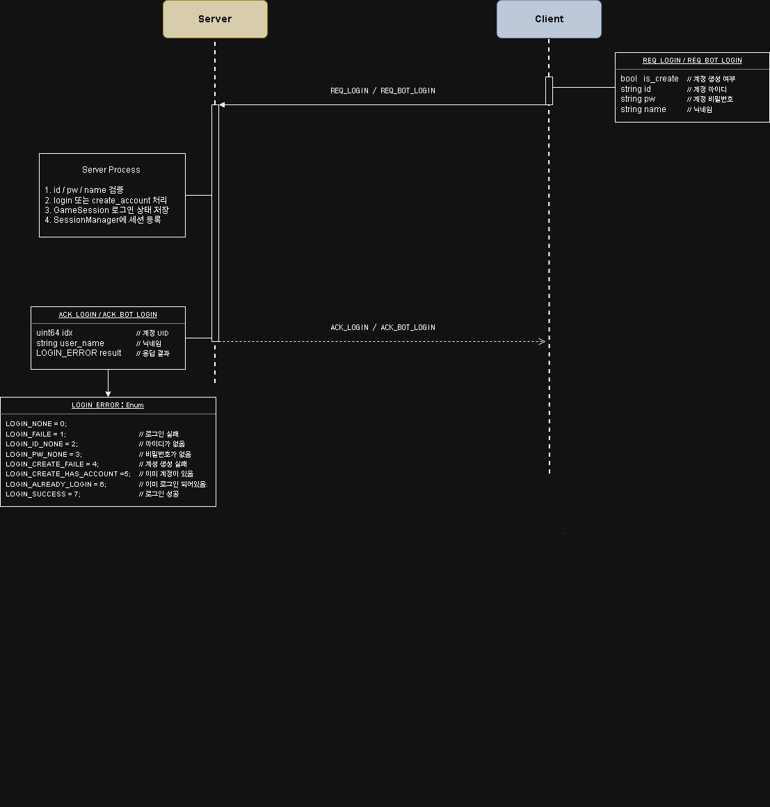
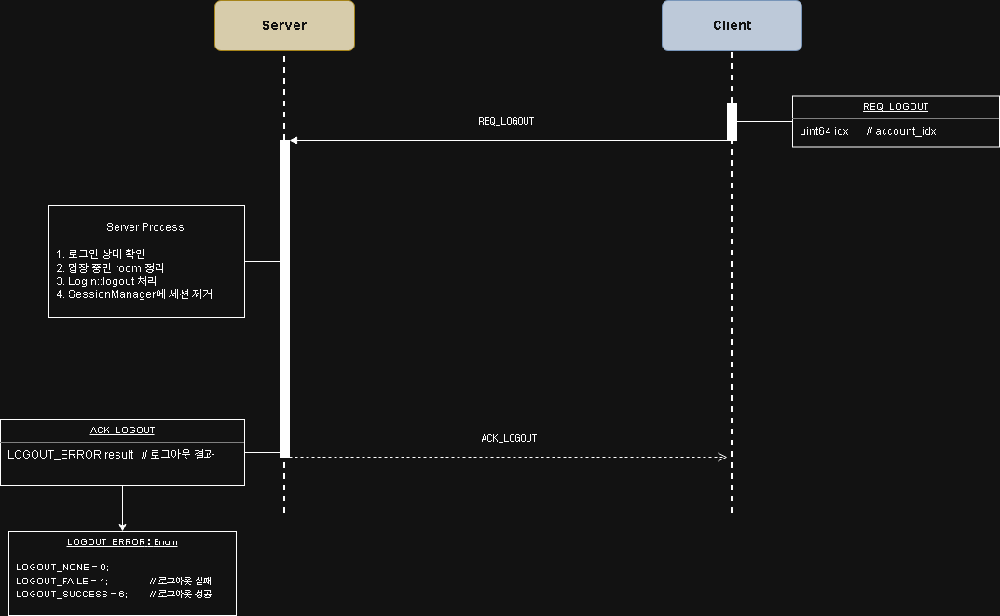
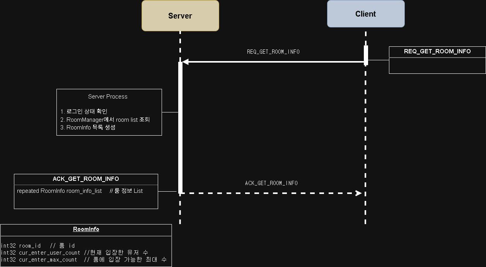
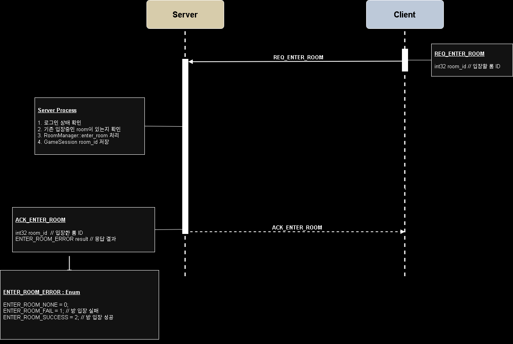
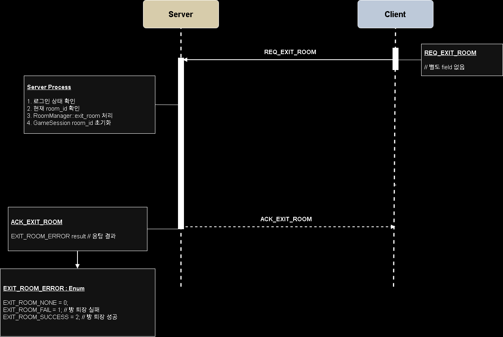
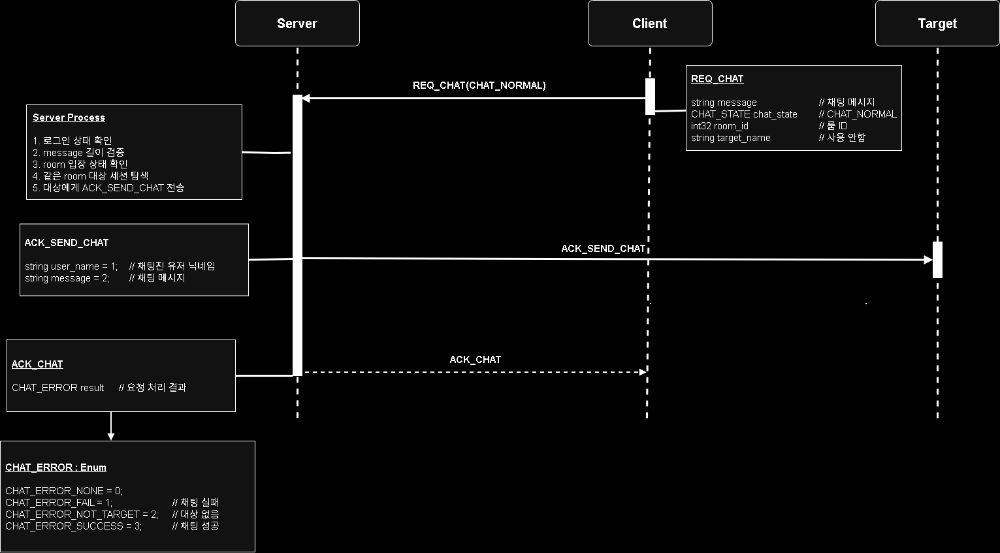
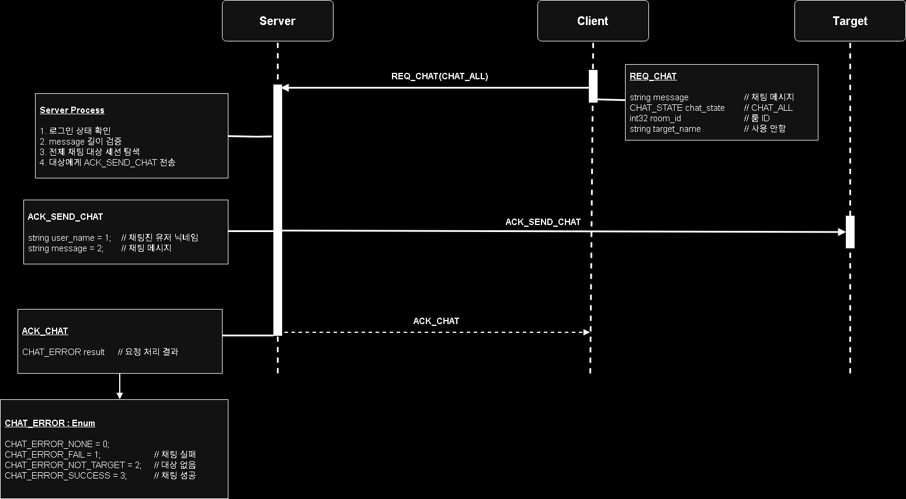
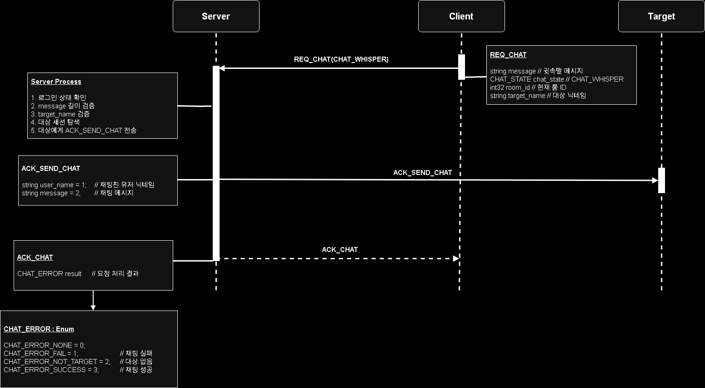

# Packet Flow

이 문서는 `GameServer`와 `TestClient` 사이에서 사용하는 주요 패킷 흐름을 정리합니다.

각 시퀀스는 `Client -> Server` 요청, 서버 내부 처리, `Server -> Client` 응답 구조를 중심으로 작성했습니다. 채팅 패킷은 요청 결과 응답과 실제 채팅 전달 패킷을 분리해서 설명합니다.

## Packet Structure

모든 패킷은 `PacketHeader`와 Protobuf body로 구성됩니다.

```txt
Packet
├─ PacketHeader
│  ├─ size
│  └─ id
└─ Protobuf Body
```

- `size`: `PacketHeader`를 포함한 전체 패킷 크기
- `id`: 패킷 타입을 구분하는 값
- `body`: Protobuf로 직렬화된 실제 패킷 데이터

## Server Dispatch Flow

서버는 수신된 데이터를 `RecvBuffer`에 기록한 뒤, 완성된 패킷 단위로 header와 body를 검증하고 packet id에 맞는 handler를 호출합니다.

```txt
Session::process_recv()
        ↓
RecvBuffer::on_write()
        ↓
Session::on_recv()
        ↓
PacketHeader 검증
        ↓
GameSession::on_recv_packet()
        ↓
ServerPacketHandler::HandlePacket()
        ↓
Protobuf ParseFromArray()
        ↓
Handle_REQ_XXX()
```

## Login / Bot Login

로그인과 봇 로그인은 같은 흐름을 사용합니다. `is_create` 값에 따라 기존 계정 로그인 또는 계정 생성을 처리합니다.



서버 처리:

- `id`, `pw`, `name` 유효성 검증
- `Login::login()` 또는 `Login::create_account()` 처리
- 성공 시 `GameSession`에 로그인 상태 저장
- `SessionManager`에 account id와 name 기준으로 세션 등록
- `ACK_LOGIN` 또는 `ACK_BOT_LOGIN` 응답

## Logout

클라이언트가 로그아웃을 요청하면 서버는 로그인 상태, room 상태, 세션 매핑 정보를 정리한 뒤 결과를 응답합니다.



서버 처리:

- 로그인 상태 확인
- 입장 중인 room이 있으면 `RoomManager::exit_room()` 처리
- `Login::logout()` 처리
- `SessionManager`에서 account/name 세션 제거
- 세션 로그인 상태 초기화
- `ACK_LOGOUT` 응답

## Get Room Info

현재 생성된 room 목록과 각 room의 현재 인원, 최대 입장 가능 인원을 조회합니다.



서버 처리:

- 로그인 상태 확인
- `RoomManager`에서 room list 조회
- `RoomInfo` 목록 생성
- `ACK_GET_ROOM_INFO` 응답

`RoomInfo` 구조:

```txt
int32 room_id
int32 cur_enter_user_count
int32 cur_enter_max_count
```

## Enter Room

클라이언트가 특정 room 입장을 요청하면 서버는 입장 가능 여부를 확인한 뒤 세션의 room 상태를 갱신합니다.



서버 처리:

- 로그인 상태 확인
- 이미 입장한 room이 있는지 확인
- `RoomManager::enter_room()` 처리
- 성공 시 `GameSession`의 room_id 저장
- `ACK_ENTER_ROOM` 응답

## Exit Room

클라이언트가 room 퇴장을 요청하면 서버는 현재 room에서 유저를 제거하고 세션의 room 상태를 초기화합니다.



서버 처리:

- 로그인 상태 확인
- 현재 room_id 확인
- `RoomManager::exit_room()` 처리
- 성공 시 `GameSession`의 room_id 초기화
- `ACK_EXIT_ROOM` 응답

## Room Chat

같은 room에 입장한 세션들에게 채팅 메시지를 전달합니다.



서버 처리:

- 로그인 상태 확인
- message 길이 검증
- room 입장 상태 확인
- 요청 packet의 room_id와 session room_id 일치 여부 확인
- 같은 room에 속한 대상 세션 탐색
- 대상 세션들에게 `ACK_SEND_CHAT` 전송
- 요청자에게 `ACK_CHAT` 응답

## All Chat

room에 입장한 전체 세션을 대상으로 채팅 메시지를 전달합니다.



서버 처리:

- 로그인 상태 확인
- message 길이 검증
- 전체 채팅 대상 세션 탐색
- 대상 세션들에게 `ACK_SEND_CHAT` 전송
- 요청자에게 `ACK_CHAT` 응답

## Whisper Chat

닉네임 기준으로 대상 세션을 찾아 1:1 채팅 메시지를 전달합니다.



서버 처리:

- 로그인 상태 확인
- message 길이 검증
- target_name 검증
- name 기준으로 대상 세션 탐색
- 대상 세션에게 `ACK_SEND_CHAT` 전송
- 요청자에게 `ACK_CHAT` 응답

대상을 찾지 못한 경우 요청자에게 `CHAT_ERROR_NOT_TARGET`을 응답합니다.

## Chat Response Separation

채팅은 두 종류의 응답 패킷을 사용합니다.

```txt
ACK_CHAT       : 요청자에게 전송하는 요청 처리 결과
ACK_SEND_CHAT  : 실제 채팅 대상에게 전송하는 채팅 메시지
```

이렇게 분리하면 요청 성공/실패와 실제 메시지 전달을 독립적으로 처리할 수 있습니다.

## Heartbeat Ping-Pong

Heartbeat는 서버 주도 방식입니다. 서버가 먼저 ping을 보내고, 클라이언트가 pong으로 응답합니다.


패킷 방향:

```txt
Server -> Client : ACK_SEND_CONNECT_PING
Client -> Server : REQ_CONNECT_PONG
```

서버 처리:

- 주기적으로 `check_heartbeat()` 실행
- `ACK_SEND_CONNECT_PING`에 `server_tick`을 담아 전송
- ping 전송 후 `waiting_pong` 상태 설정
- pong 수신 시 `last_pong_tick` 갱신
- `waiting_pong` 상태 해제
- timeout 시 disconnect 처리

## Summary

패킷 처리 원칙은 다음과 같습니다.

- 모든 요청은 서버에서 상태와 payload를 검증합니다.
- 요청 처리 결과는 ACK 패킷으로 응답합니다.
- 채팅은 요청 결과 패킷과 메시지 전달 패킷을 분리합니다.
- Heartbeat는 서버가 먼저 ping을 보내는 구조입니다.
- 비정상 상태는 disconnect cleanup으로 이어집니다.

